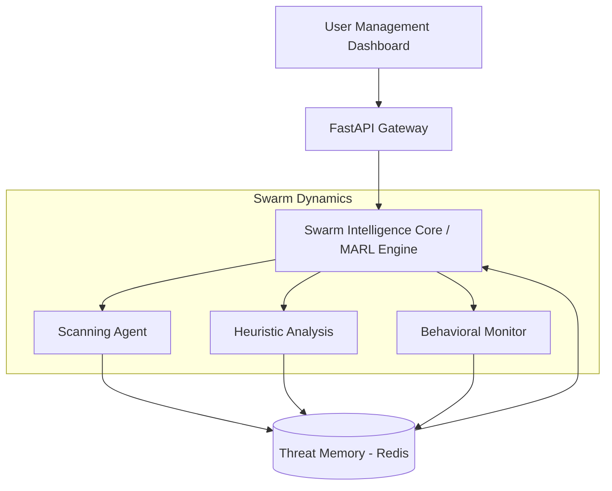

<h1 align="center">Hornet Defence</h1>

<strong>Autonomous Cybersecurity Orchestration Powered by Swarm Intelligence</strong>

<em>Self-Learning • Distributed Defense • Evolutionary Neural Security</em>

Executive Summary
Hornet Defence is a paradigm shift in digital asset protection. By transcending traditional heuristic and signature based detection, we provide a decentralized swarm of intelligent agents designed to neutralize threats at the edge.
Unlike legacy antivirus solutions, Hornet Defence leverages a collective intelligence model to identify, isolate, and adapt to zero day vulnerabilities before they propagate.
 Proactive Neutralization Real time threat hunting via autonomous agents.
 Collaborative Intelligence Multi-Agent Reinforcement Learning (MARL) for coordinated defense.
 Adaptive Evolution Continuous strategy refinement through LLM driven decision making.

The Problem
Current cybersecurity infrastructure is fundamentally flawed by its static nature
Reactive Posture:Reliance on known signatures leaves systems blind to novel exploits.
Latent Response:Centralized decision making creates bottlenecks during high velocity attacks.
Predictability: Linear defense logic is easily mapped and bypassed by sophisticated adversarial AI.
The Solution: Swarm Cortex Architecture
Hornet Defence implements a Swarm Cortex framework, moving away from centralized vulnerability to distributed resilience.
Autonomous Edge Agents: Independent nodes pthat hunt and mitigate local threats.
lGlobal Q Learning: A shared neural memory ensures that when one agent learns a defense, the entire swarm inherits the immunity.
LLM Driven Heuristics: Utilizing Llama 3 for high context reasoning and complex threat analysis.
Non Linear Defense: Dynamic strategy shifts that make the system an "unpredictable target" for attackers.
System Architecture

Technical Stack
 Inference Engine:** Ollama (Llama 3)
 Core Logic:** Multi Agent Reinforcement Learning (MARL)
 Backend: Python / FastAPI
 State Management: Redis (High speed shared intelligence)
>Project Vision: To bridge the gap between human-led security operations and fully autonomous, self healing digital ecosystems.
add 
